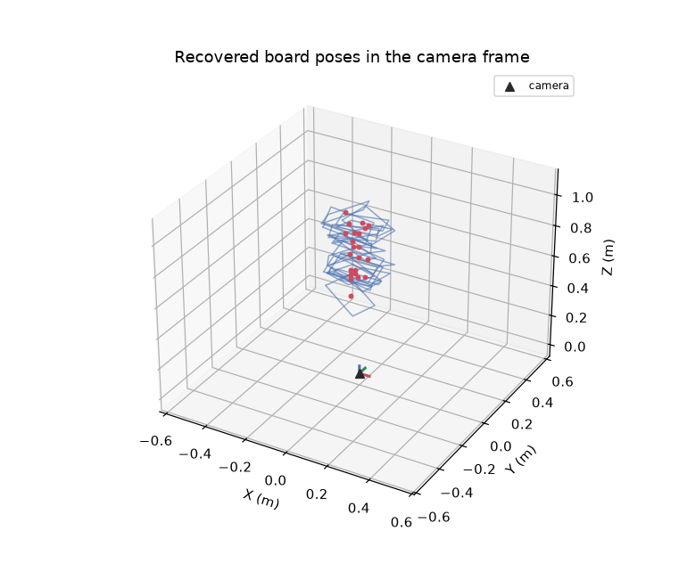
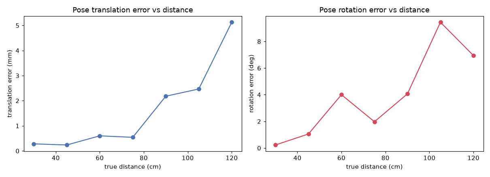
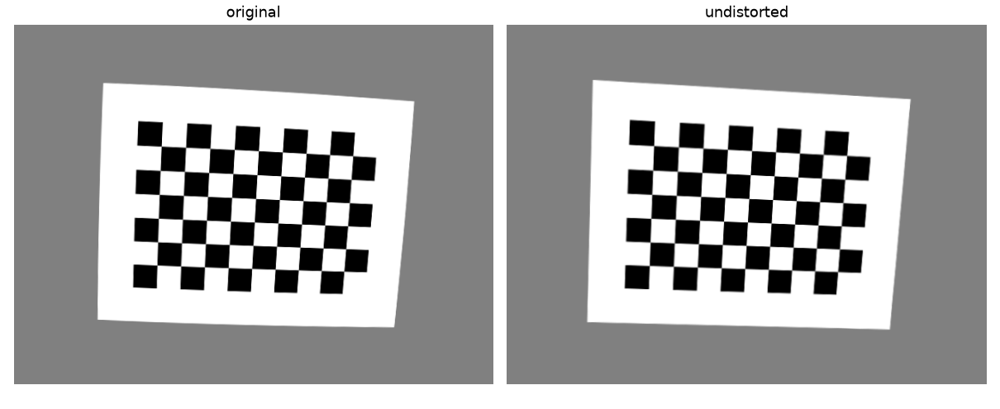
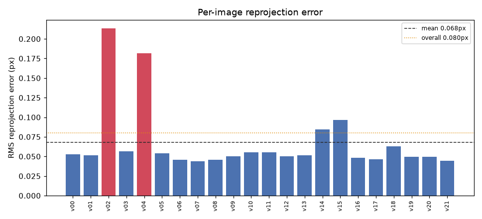
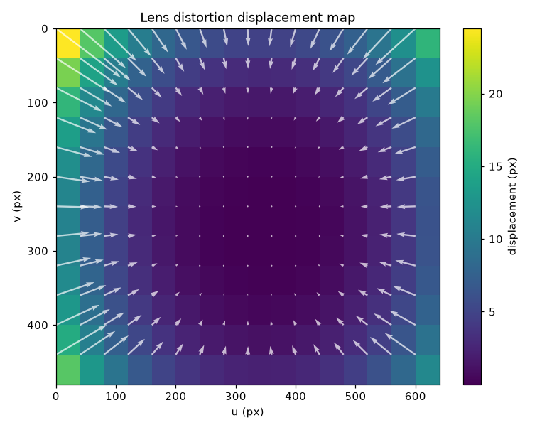
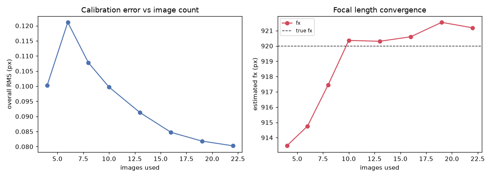
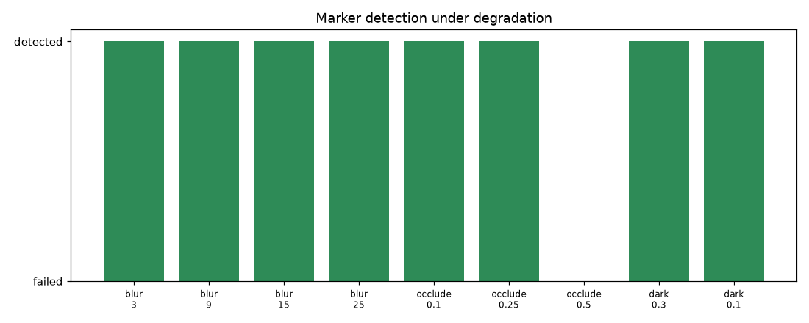

# campose — Camera Calibration & 6-DoF Pose Estimation Toolkit

**Camera calibration and 6-DoF pose estimation with diagnostic reporting and
accuracy evaluation — not another `cv2.calibrateCamera()` wrapper.**

Most calibration code treats OpenCV as a black box: call one function, print a
matrix, move on. This toolkit instead exposes and *checks* every step — the
projection math is written out by hand and tested against OpenCV to
floating-point precision, calibration comes with per-image error and bootstrap
confidence, and pose estimation ships with a real accuracy and robustness
evaluation. It is a small, modular library you could `pip install` and use on
your own camera.

<p align="center">
  
  
</p>

> **A note on the sample data.** This repository ships with a *synthetic* sample
> set rendered by the toolkit's own virtual camera (`campose.synthetic`), with
> exact ground truth recorded in `data/ground_truth.json`. That is deliberate:
> it lets every number below be checked against a known answer rather than a
> screenshot. Calibrating your own real camera is one command away — see the
> [capture guide](docs/capture_guide.md).

---

## Why this exists

Calibration and pose estimation are the "can you actually do geometry" test for
any computer-vision role touching robotics, AR, or inspection. The differentiator
here is rigour: understand the model, expose the intermediate math, report error
honestly, and quantify where things break.

The full derivations live in [`docs/theory.md`](docs/theory.md) — pinhole model,
distortion, calibration as least-squares, and the PnP solvers.

---

## Install

```bash
pip install -e .          # from a clone
# or just the runtime deps:
pip install -r requirements.txt
```

Dependencies are deliberately minimal: `numpy`, `opencv-python`, `matplotlib`,
`pyyaml`.

---

## Quick start (Python API)

```python
from campose import CameraCalibrator, CheckerboardSpec, PoseEstimator

# 1. Calibrate a camera from a folder of checkerboard images
calibrator = CameraCalibrator(CheckerboardSpec(9, 6, square_size=0.025))
calibrator.add_images("data/sample_calibration_images/")
result = calibrator.calibrate()
print(result.summary())            # K, distortion, per-image error, verdict
result_path = "calibration.json"
from campose import io; io.save(result, result_path)

# 2. Estimate an object's 6-DoF pose from a single image
import cv2
estimator = PoseEstimator.from_calibration(result_path)
pose = estimator.estimate_aruco(cv2.imread("data/sample_aruco_images/aruco_00.png"),
                                marker_size=0.08)[0]
print(pose.translation, pose.rotation_euler, pose.reprojection_error)
```

---

## Command line

```bash
# Calibrate, with bootstrap confidence on the parameters
python -m campose calibrate --images data/sample_calibration_images \
    --board-size 9x6 --square-size 0.025 --output calibration.json --bootstrap 50

# Estimate pose from one image
python -m campose estimate --calibration calibration.json \
    --image data/sample_aruco_images/aruco_00.png --target aruco --marker-size 0.08

# Live webcam demo with 3D axis overlay, pose readout, FPS, and quality light
python -m campose live --calibration calibration.json --target aruco --marker-size 0.08
```

The live overlay draws the canonical RGB=XYZ axes on each marker plus a
per-frame reprojection-error quality indicator (green → good, red → suspect):

<p align="center">
  
</p>

---

## Calibration results (bundled synthetic set)

Recovered from 22 synthetic images against a known ground truth of
`fx=920, fy=918, cx=328, cy=244`:

| Parameter | Recovered | Ground truth |
|-----------|-----------|--------------|
| `fx, fy`  | 921.2, 919.1 | 920, 918 |
| `cx, cy`  | 329.7, 244.1 | 328, 244 |
| overall RMS reprojection error | **0.08 px** | — |

<p align="center">
  
  
</p>

The per-image chart flags outliers automatically (mean + 2σ); the distortion map
shows how many pixels the lens model displaces each location.

---

## Evaluation

Four experiments, reproducible via `evaluation/` and `scripts/make_figures.py`.

### 1. How many images do you actually need?

Error falls and focal length converges as images accumulate, with clear
diminishing returns past ~15–20 views.

<p align="center"></p>

### 2. Pose accuracy vs distance

Translation error stays sub-millimetre up close and grows with distance, as the
marker shrinks in the image. Rotation error grows too and is noisiest when a
planar marker turns to face the camera (the planar ambiguity, discussed in the
theory doc).

<p align="center"></p>

### 3. PnP solver comparison

Same marker, every applicable solver, scored against ground truth:

| solver | trans err (mm) | rot err (deg) | reproj (px) | time (ms) |
|--------|---------------:|--------------:|------------:|----------:|
| ippe_square | 0.67 | 0.89 | 0.254 | **0.04** |
| ippe | 0.67 | 0.89 | 0.254 | 0.23 |
| ap3p | 0.69 | 0.30 | 0.219 | 0.24 |
| p3p | 0.69 | 0.30 | 0.219 | 0.26 |
| iterative | 0.69 | 0.30 | 0.219 | 0.38 |
| sqpnp | 0.69 | 0.30 | 0.219 | 0.44 |
| epnp | 0.69 | 0.30 | 0.219 | 0.65 |

`ippe_square` is by far the fastest for square markers; the general solvers are
marginally more accurate in rotation. `campose.solvers.compare_solvers` produces
this table for any correspondence set.

### 4. Robustness under degradation

Blur, occlusion, and low light at increasing severity. ArUco detection tolerates
heavy blur and low light but fails once ~50% of the marker is occluded — the
motivation for the ChArUco stretch goal.

<p align="center"></p>

---

## Package layout

```
campose/
├── rotations.py       # Rodrigues / matrix / Euler conversions
├── camera_model.py    # pinhole projection + distortion, by hand
├── board.py           # checkerboard spec + corner detection
├── calibrator.py      # CameraCalibrator: solve + diagnostics + bootstrap
├── results.py         # CalibrationResult / BoardPose value objects
├── io.py              # JSON / YAML / npz save + load
├── solvers.py         # unified PnP solver interface
├── pose_estimator.py  # ArUco + planar-target 6-DoF pose
├── visualization.py   # 3D poses, distortion maps, error charts, axis overlay
├── evaluation.py      # the four experiment runners
├── synthetic.py       # virtual camera with exact ground truth
├── live.py            # real-time webcam annotation loop
└── cli.py             # calibrate / estimate / live
```

---

## Honest limitations

- **Planar targets only.** ArUco and flat feature targets are supported; full 3D
  object tracking from a CAD model is not.
- **Single camera.** No stereo calibration or depth from disparity.
- **No temporal filtering.** Poses are estimated per frame; a Kalman/EKF smoother
  would steady the live demo but is not implemented.
- **Sample data is synthetic.** Real-camera calibration is fully supported and
  documented, but the bundled images come from the virtual camera so ground
  truth is exact.

## Extensions (natural next steps)

Stereo calibration · ChArUco boards for graceful occlusion handling · temporal
pose smoothing (EKF) · multi-marker board pose · automatic capture-quality
warnings.

---

## Notebooks

Three executed walkthroughs live in [`notebooks/`](notebooks/):

1. `01_calibration_walkthrough.ipynb` — calibrate, read every diagnostic, and
   check the estimate against ground truth.
2. `02_pose_estimation_demo.ipynb` — recover a marker's 6-DoF pose, draw the
   axes, and compare PnP solvers.
3. `03_evaluation_results.ipynb` — reproduce all four evaluation experiments.

## Development

```bash
pip install -e ".[dev]"
pytest                                   # 20 tests, geometry verified vs OpenCV
python scripts/generate_sample_data.py   # regenerate the synthetic sample set
python scripts/make_figures.py           # regenerate every figure in this README
```

Licensed under the MIT License.
